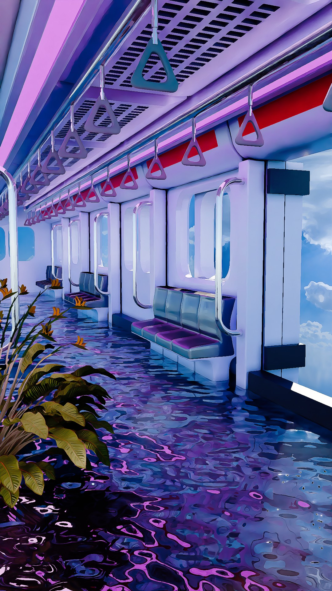

# 🚇 Dreamy Train Interior Animation

Welcome to my 3D creative project! This animation captures a surreal, liminal space featuring a flooded train interior, brought to life with atmospheric lighting and dreamlike aesthetics. ✨🌊

## 🎨 About the Project
This project was designed and animated using **Blender**. The goal was to create a sense of calm, otherworldly immersion by combining architectural elements with fluid water simulation and soft, vibrant lighting. 🌌

## 🛠️ Technical Details
* **Software:** Blender
* **Focus:** Environmental Design, Lighting, & Mood Setting
* **Vibe:** Surreal, Liminal, Dreamy

## 🚀 Future Plans
I am currently working on a larger project titled **Future Legends 2**. I aim to incorporate creative environments like this one into my game development workflow to enhance the overall player experience! 🎮🔥

## 💬 Let's Connect!
I love creating! Whether it's games, music, or 3D art, I’m always working on something new.

* **Game Dev:** Developing with Unreal Engine 5.6.1
* **Creative Focus:** Crafting immersive worlds and stories 🎬

---
*Created with passion by MephistoAUK* ⚡
